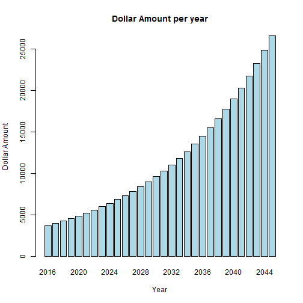

Simple Investment Calculator
========================================================
author: Nirave Kadakia
date: April 27, 2016

Simple Investment Calculator
========================================================

This is a simple presentation about the Simple Investment Calculator.

- Available here: https://nirave.shinyapps.io/project/
- Calculates the final dollar amount of an investment over a few years
- Final project of Coursera's Developing Data Products Course

How to use
========================================================

To use the calculator, simply input the following information

- Expected Return Rate of the Investment
- Years to Invest
- Initial Investment in dollars

All information will be updated automatically in real time

Output
========================================================

The final dollar amount will be shown.  Here is an example
- Return rate: 7%
- Years to Invest: 30
- Initial Investment: $3500


```
[1] 28000
```

Output (cont'd)
========================================================
In addition, a chart will show the dollar growth through the years


